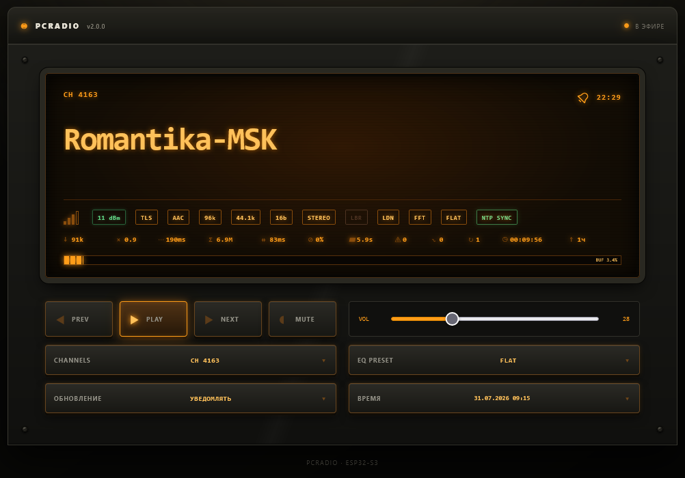

# PCRadio ESP32

Интернет-радиоприёмник на базе ESP32-S3 с управлением через встроенный
web-интерфейс.

Перед первым включением установите программное обеспечение по
[инструкции по прошивке устройства](firmware.md).

## Первое включение

1. Включите устройство и дождитесь появления открытой Wi-Fi-сети
   `ESP32-Radio-XXXX`.
2. Подключитесь к ней с телефона или компьютера. Страница первоначальной
   настройки должна открыться автоматически.
3. Если captive portal не открылся, введите в браузере адрес `192.168.4.1`.
4. Выберите домашнюю Wi-Fi-сеть и укажите пароль. Перед сохранением устройство
   проверит подключение.
5. После успешной проверки устройство подключится к выбранной сети и отключит
   свою точку доступа. Его новый IP-адрес можно посмотреть в интерфейсе
   маршрутизатора.

Если основная Wi-Fi-сеть недоступна при загрузке, устройство снова поднимет
точку доступа для изменения настроек и продолжит попытки подключения.

## v.2.0.0

Основные возможности:

- воспроизведение интернет-радиостанций MP3, AAC, FLAC, OGG Vorbis и Opus;
- поддержка плейлистов M3U и M3U8;
- защищённые HTTPS-потоки с обязательной проверкой TLS-сертификатов;
- отображение названия станции, ICY-метаданных и параметров аудиопотока;
- избранное, пользовательские станции и локальный рейтинг;
- эквалайзер, loudness, обработка низкого битрейта и расширение стереобазы;
- управление воспроизведением, громкостью и выбором станции;
- будильники с выбором радиостанции и плавным увеличением громкости;
- первоначальная настройка Wi-Fi через captive portal;
- автоматическая регулировка мощности Wi-Fi;
- ручное и автоматическое обновление прошивки и web-интерфейса;
- сохранение пользовательских настроек в отдельном разделе памяти.
