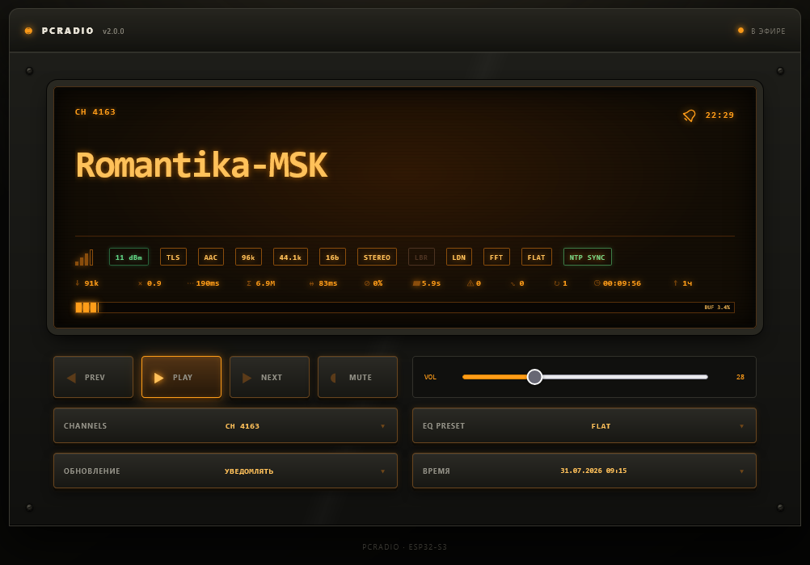

# PCRadio ESP32

Интернет-радиоприёмник на базе ESP32-S3 с управлением через встроенный
web-интерфейс.

Текущая версия: **3.0.0**. Ветка прошивок и интернет-обновлений: **`v3`**.
Устройство использует Flash 16 МиБ и LittleFS с блоками 64 КиБ.

Скриншот интерфейса версии 2.0.0.

## Установка и обновления

Первую установку и переход с 1.x/2.x выполняй через Flash Download Tool
с полным стиранием Flash. Версия 3.0.0 использует новую разметку;
старые настройки и плейлисты при стирании удаляются.

После установки 3.x совместимые firmware и WebUI обновляются парой через OTA
из ветки `v3`. Пользовательские данные при таком обновлении сохраняются.
OTA между разными MAJOR-версиями не поддерживается.

Адреса записи и порядок установки находятся в
[инструкции по прошивке](docs/Software/firmware.md).

## Первое включение

1. Включи устройство и дождись появления открытой Wi-Fi-сети
   `ESP32-Radio-XXXX`.
2. Подключись к ней с телефона или компьютера. Страница первоначальной
   настройки должна открыться автоматически.
3. Если captive portal не открылся, введи в браузере адрес `http://192.168.4.1`.
4. Выбери домашнюю Wi-Fi-сеть и укажи пароль. Перед сохранением устройство
   проверит подключение.
5. После успешной проверки устройство подключится к выбранной сети и отключит
   свою точку доступа. Его новый IP-адрес можно посмотреть в интерфейсе
   маршрутизатора.

Если основная Wi-Fi-сеть недоступна при загрузке, устройство снова поднимет
точку доступа для изменения настроек и продолжит попытки подключения.

## Возможности

- воспроизведение интернет-радиостанций MP3, AAC, FLAC, OGG Vorbis и Opus;
- поддержка плейлистов M3U и M3U8;
- защищённые HTTPS-потоки с обязательной проверкой TLS-сертификатов;
- отображение названия станции, ICY-метаданных и параметров аудиопотока;
- избранное, пользовательские станции и локальный рейтинг;
- эквалайзер, loudness, обработка низкого битрейта и расширение стереобазы;
- управление воспроизведением, громкостью и выбором станции;
- будильники с выбором радиостанции и плавным увеличением громкости;
- первоначальная настройка Wi-Fi через captive portal;
- автоматическая регулировка мощности Wi-Fi;
- ручное и автоматическое обновление прошивки и web-интерфейса;
- сохранение пользовательских настроек в отдельном разделе памяти.

## Документация

- [Установка, разметка Flash и обновления](docs/Software/firmware.md).
- [История изменений прошивки](docs/Software/firmware_changes.md).
- [Назначение GPIO](docs/Hardware/GPIO_Pinout.md).

## Лицензия

[WTFPL](LICENSE)

- Полная свобода: можно копировать, менять, продавать и распространять.
- Без гарантий: автор не дает никаких обещаний, не отвечает за ошибки.
- Без ограничений: все правила сводятся к одной фразе - делай что хочешь.
