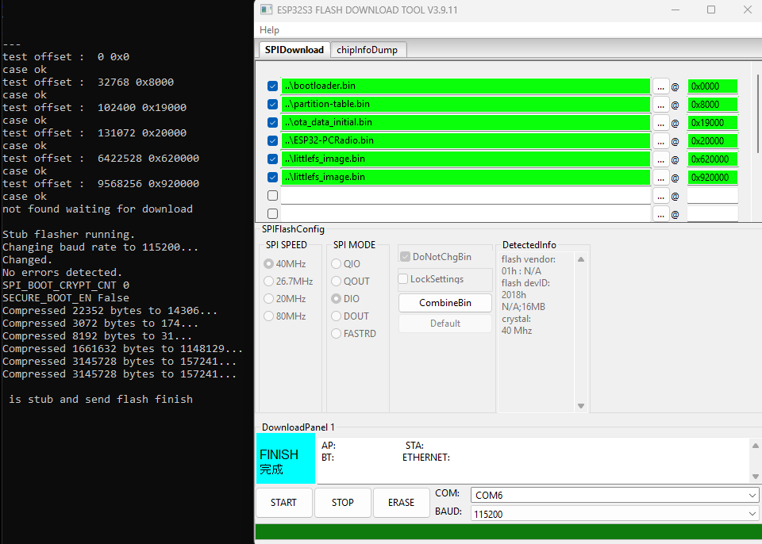

# Установка и обновление PCRadio 3.0.0

Версия 3.0.0 использует новую разметку Flash и блоки LittleFS по **64 КиБ**.
Первая установка и переход с 1.x/2.x выполняются через
[Espressif Flash Download Tool](https://docs.espressif.com/projects/esp-test-tools/en/latest/esp32/production_stage/tools/flash_download_tool.html).
Обычное OTA доступно после перехода, внутри ветки 3.x.

## Перед переходом с 1.x/2.x

**Новая разметка несовместима со старой.** WebUI 3.x занимает часть прежнего
`/userdata`. Даже запись только нового WebUI по новым адресам может уничтожить
старые пользовательские данные. Нельзя смешивать образы 2.x и 3.x.

`ERASE` полностью удаляет прошивку, настройки Wi-Fi, плейлисты, избранное,
будильники и остальные сохранённые данные.

## Комплект прошивки

Используй файлы одной версии из [ветки v3](https://github.com/RootShell-coder/pcradio.esp32/tree/v3).
Нужны пять бинарных файлов, записываемых по шести адресам:

| Адрес | Файл | Назначение |
| ---: | --- | --- |
| `0x0000` | `bootloader.bin` | загрузчик |
| `0x8000` | `partition-table.bin` | новая таблица разделов |
| `0x19000` | `ota_data_initial.bin` | начальное состояние OTA |
| `0x20000` | `ESP32-PCRadio.bin` | основная прошивка |
| `0x620000` | `littlefs_image.bin` | основной WebUI-слот |
| `0x920000` | `littlefs_image.bin` | резервный WebUI-слот |

Один образ `littlefs_image.bin` записывается дважды. Его размер для 3.0.0:
**3 145 728 байт (3 МиБ)**. Адреса, размеры и SHA-256 комплекта перечислены
в `flash-manifest.json` рядом с бинарными файлами.



## Разметка Flash

Устройство: ESP32-S3, Flash 16 МиБ. Три раздела LittleFS используют блоки
65536 байт (64 КиБ). Это размер блока файловой системы, а не страницы записи
и не настройка оперативной памяти.

| Раздел | Адрес | Размер | Назначение |
| --- | ---: | ---: | --- |
| `nvs` | `0x9000` | `0x4000` | Wi-Fi и служебные настройки |
| `nvs_ext` | `0xD000` | `0xC000` | резерв NVS |
| `otadata` | `0x19000` | `0x2000` | выбор загрузочного application-слота |
| `phy_init` | `0x1B000` | `0x1000` | данные PHY |
| резерв | `0x1C000` | `0x4000` | выравнивание application |
| `ota_0` | `0x20000` | `0x300000` | application A, 3 МиБ |
| `ota_1` | `0x320000` | `0x300000` | application B, 3 МиБ |
| `storage` | `0x620000` | `0x300000` | WebUI A, 48 блоков по 64 КиБ |
| `storage_ota` | `0x920000` | `0x300000` | WebUI B, 48 блоков по 64 КиБ |
| `userdata` | `0xC20000` | `0x3E0000` | пользовательские данные, 62 блока по 64 КиБ |

Загрузчик записывается по адресу `0x0000`, таблица разделов по `0x8000`.
Конец `/userdata` совпадает с концом 16-МиБ Flash: `0x1000000`.

### Совместимость памяти

Для LittleFS требуется корректная поддержка стирания 64 КиБ в соответствующей
области Flash. NVS и служебные разделы сохраняют геометрию ESP-IDF и требуют
поддержки стирания 4 КиБ в нижней области Flash. Переход на 64 КиБ не означает
поддержку любой микросхемы памяти.

Старые образы LittleFS с блоками 4 КиБ нельзя использовать с новой прошивкой.
Переход с 2.x требует чистой установки через Flash Download Tool с полным
стиранием Flash.

Внутри 3.x OTA обновляет application и WebUI, сохраняя пользовательские
разделы. Следующее несовместимое изменение разметки или файловой системы
требует новой MAJOR-версии.

## Настройки Flash Download Tool

- ChipType: `ESP32-S3`.
- SPI MODE: `DIO`.
- SPI SPEED: `80 MHz`.
- FLASH SIZE: `16 MB`.
- Выбран COM-порт устройства.
- Включены флажки всех шести строк с образами.

## Чистая установка

1. Подключи устройство по USB и выбери его COM-порт.
2. Добавь все шесть строк из таблицы выше.
3. Проверь адреса, настройки и принадлежность файлов одной версии 3.x.
4. Нажми `ERASE` и дождись полного стирания.
5. Нажми `START` и дождись успешной записи всех образов.
6. Перезагрузи устройство. Пустой `/userdata` автоматически создаётся с блоками 64 КиБ.
7. Подключись к открытой сети `ESP32-Radio-XXXX`.
8. Открой `http://192.168.4.1`, если страница настройки не появилась автоматически.
9. Настрой домашнюю Wi-Fi-сеть. Новый адрес устройства можно посмотреть на маршрутизаторе.

До настройки Wi-Fi загрузка плейлиста и интернет-обновления недоступны.
После подключения проверь основной плейлист и воспроизведение станции.

## Последующие обновления 3.x

Совместимые firmware и WebUI обновляются парой через OTA в веб-интерфейсе.
При таком обновлении `/userdata` и NVS не перезаписываются.
OTA между разными MAJOR-версиями запрещено.

Прошивка 3.0.0 проверяет манифест и его подпись в ветке `v3`:

```text
https://raw.githubusercontent.com/RootShell-coder/pcradio.esp32/refs/heads/v3/update-manifest.json
https://raw.githubusercontent.com/RootShell-coder/pcradio.esp32/refs/heads/v3/update-manifest.json.sig
```

Адреса firmware и WebUI берутся из подписанного манифеста. Весь комплект
обновления должен соответствовать одной версии. Ветка `update` больше
не является источником обновлений прошивки 3.0.0.

[История изменений](firmware_changes.md)
